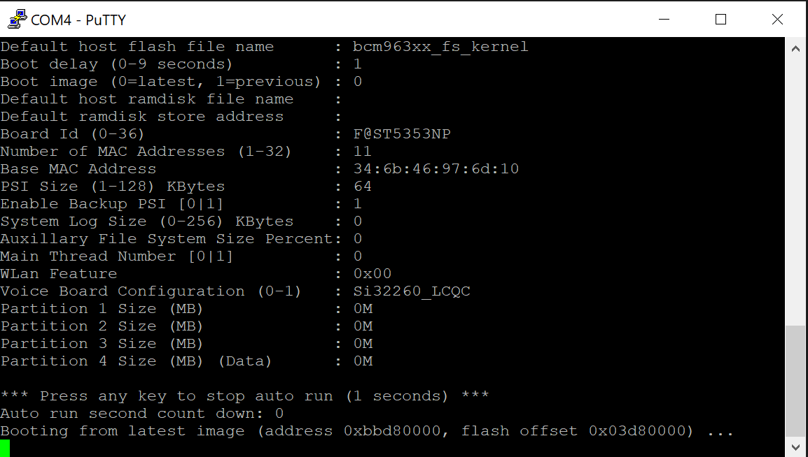

# Reverse Engineering Sagemcom Gateway F@ST 3864V3 AC Router

## The Router

The Sagemcom Gateway F@ST is a basic router provided by ISP's to enable easier connection to their network.

_A view from the front of the sagemcom router_

This model in particular is a VDSL/ADSL modem with a wireless access point along with Ethernet and phone ports.

## Pulling Apart and Setting Up

The intention during this phase was to reverse engineer the router and discover how it works. It is common for complex electronics to have some sort of serial transmit/receive. This serial connection usually takes the form of a few pads on the PCB; one connection for transmit, receive, and ground as well as an optional power connection. This is the kind of connection we will be looking for when inspecting inside the router.

### The Guts

The device was secured by four Phillips screws on the back and two hidden under the device information sticker on the bottom.

_Back of router with holes for screws_

Once the screws were undone, the plastic back simply pops-off from the front with a small amount of force. Once the back was removed, the circuit board was seen clipped into the front piece of the housing.

_PCB in plastic housing_

By pressing down on the clips the PCB also popped out from its seat and could be completely seperated from the plastic covering.

_PCB removed from its casing with IO header showing_

### Inspecting the Board to Find...

... those "secret" serial connection pads. Or in this case, not so secret serial pads; the OEM was kind enough to silk screen labels for the pads. The labels on the PCB marked out four inconspicous empty pads. These labels included `GND`, `Tx`, `Rx`, and `3.3V` - a clear indication that this cluster of pads together form a single serial port.

_PCB with the serial pads visible labelled as `GND`, `Tx`, `Rx`, `3.3V` (the pin header was added after the fact)_

Out of the box the serial pads had globs of solder filling the holes without a pin header. Fortunately the old solder was reasonably easy to re-flow and allowed for a pin header row to be soldered to the pads.

Unfortunately attaching a new header to filled-in pads can be difficult to get well-aligned by hand. However, provided the connection between each pad is solid and without any short circuits, some misalignment in the pin header is usually acceptable. After all the purpose of the header is to provide reliable serial access, not re-sell the PCB!

## Interacting over Serial

Since the serial port has both a `Rx` and `Tx` input/output, it can be interacted with via UART communication. By using a standard USB to UART cable the serial interface can be accessed through a terminal application running on a PC.

### USB to UART - Plugging In

Typical USB to UART cables colour-code each individual wire depending on its functionality. As standard with almost all electronics, the RED and BLACK wires are +V (+5/3.3V for UART) and GND respectively. The two remaining leads are GREEN for transmit (`Tx`) and WHITE for receive (`Rx`).

To connect two UART interfaces, the opposite types need to be connected together. For example, the `Tx` of the UART cable should be attached to the `Rx` on the board. Similarly, the WHITE (`Rx`) wire should be hooked-up to the `Tx` pad. The reason behind this is obvious; the transmit output wire needs to feed into a receive input, and vice versa.

The remaining `GND` lead should be attached to the `GND` pad, while the RED cable is left unconnected.

#### WARNING!

Attaching the RED power lead to any voltage output on the board side could result in **irreversible** damage to the UART cable and/or the circuit board.

_USB to UART cable attached to the newly attached serial port pin header_

_UART cable attached with the silk screen labels visible_

### Connecting to the Terminal

Once connected on the board side, the cable can be plugged into a PC. A program to connect to serial ports can be used such as [PuTTY](https://www.putty.org/) (for Windows) or [screen](https://linux.die.net/man/1/screen) (for Linux/Mac OS). To connect to the serial port two parameters are required; the port name and the baud rate. The port name can be found by looking through the device manager (for Windows) or the `/dev` directory (for Linux/Mac OS).

 
_Windows device manager showing port name of USB to UART_

The baud rate is slightly more tricky, as it requires a bit of trial and error. This parameter is the rate at which information is transferred over the serial interface. Without a common rate between the board and interface the sent and received bytes will be undecipherable. Luckily there are common baud rates that can be iterated through until the text on the screen resembles what we are looking for.

#### Incorrect Baud Rate

_Baud rate of 9600 shows garbled text as it does not match the rate used by the circuit board_

#### Correct Baud Rate

_Readable output displaying, indicating that the circuit is operating at a rate of 115200_

### Serial is a Two-Way Street

Once connected **a lot** of information will begin to print to the screen, seemingly flying by as the router boots up. This is just the debug output (refer to `boot_debug.log` for the full output). However, once the router has completed booting and the output begins to slow down it is also possible to interact with the device over the serial connection. By pressing enter, the terminal prompts for a username and login.

_Login prompt after pressing **enter** key_

### Reseting to Find... Logins!

> TO BE CONTINUED
